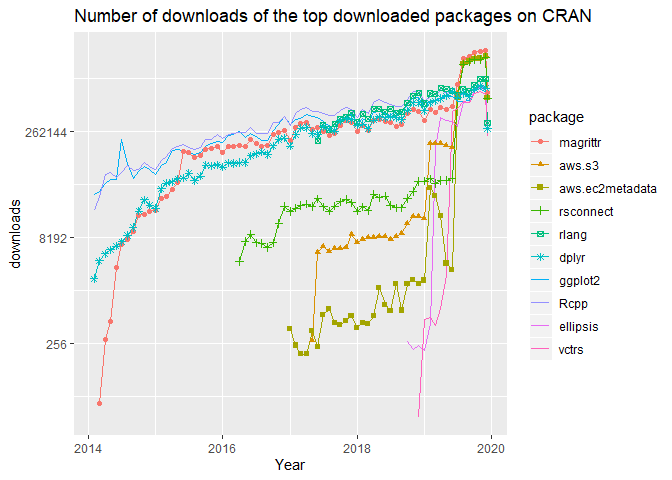
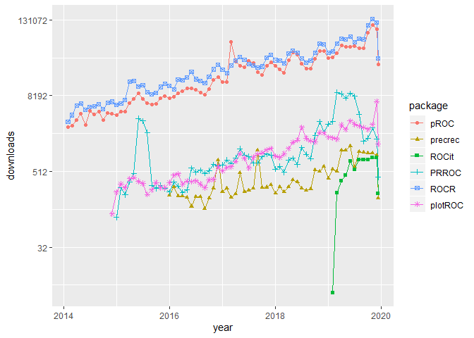

Search and Query CRAN R Packages
================

## Introduction

This post present package ‘pkgsearch’ that uses R-hub web services that
munge CRAN metadata and let you access it through several lenses. It is
such interesting to use this package to exploit the information ralated
to a given package as well as discover the new packages on CRAN.

The codes below are going to illustrate how pkgsearch is helpful in data
analysis in R.

### Installation

Install the required pkgsearch release from CRAN:

``` r
#pkg_need <- c("tidyverse","dlstats", "pkgsearch")
library(tidyverse)  # for data manipulation
```

    ## -- Attaching packages --------------------------------------------------------------- tidyverse 1.2.1 --

    ## v ggplot2 3.2.1     v purrr   0.3.2
    ## v tibble  2.1.3     v dplyr   0.8.3
    ## v tidyr   1.0.0     v stringr 1.4.0
    ## v readr   1.3.1     v forcats 0.4.0

    ## -- Conflicts ------------------------------------------------------------------ tidyverse_conflicts() --
    ## x dplyr::filter() masks stats::filter()
    ## x dplyr::lag()    masks stats::lag()

``` r
library(dlstats)    # for package download stats
library(pkgsearch)  # for searching packages
```

### Usage

#### Exploit the information

##### Get package metadata

Find the dependencies the first versions of ‘ggplot2’ had and when each
of these versions was released?

``` r
pkgsearch::cran_package_history("ggplot2")
```

    ## # A tibble: 36 x 28
    ##    Package Type  Title Version Date  Author Maintainer Description License
    ##  * <chr>   <chr> <chr> <chr>   <chr> <chr>  <chr>      <chr>       <chr>  
    ##  1 ggplot2 Pack~ An i~ 0.5     2007~ Hadle~ Hadley Wi~ "An implem~ GPL    
    ##  2 ggplot2 Pack~ An i~ 0.5.1   2007~ Hadle~ Hadley Wi~ "An implem~ GPL    
    ##  3 ggplot2 Pack~ An i~ 0.5.2   2007~ Hadle~ Hadley Wi~ "An implem~ GPL    
    ##  4 ggplot2 Pack~ An i~ 0.5.4   2007~ Hadle~ Hadley Wi~ "An implem~ GPL    
    ##  5 ggplot2 Pack~ An i~ 0.5.5   2007~ Hadle~ Hadley Wi~ "An implem~ GPL    
    ##  6 ggplot2 Pack~ An i~ 0.5.6   2007~ Hadle~ Hadley Wi~ An impleme~ GPL    
    ##  7 ggplot2 Pack~ An i~ 0.5.7   2007~ Hadle~ Hadley Wi~ An impleme~ GPL    
    ##  8 ggplot2 Pack~ An i~ 0.6     2008~ Hadle~ Hadley Wi~ An impleme~ GPL    
    ##  9 ggplot2 Pack~ An i~ 0.7     2008~ Hadle~ Hadley Wi~ An impleme~ GPL    
    ## 10 ggplot2 Pack~ An i~ 0.8     2008~ Hadle~ Hadley Wi~ An impleme~ GPL    
    ## # ... with 26 more rows, and 19 more variables: SaveImage <chr>,
    ## #   LazyData <chr>, Packaged <chr>, crandb_file_date <chr>, date <chr>,
    ## #   dependencies <list>, URL <chr>, LazyLoad <chr>, Extends <chr>,
    ## #   Collate <chr>, Repository <chr>, `Date/Publication` <chr>,
    ## #   NeedsCompilation <chr>, VignetteBuilder <chr>, BugReports <chr>,
    ## #   `Authors@R` <chr>, RoxygenNote <chr>, Encoding <chr>, MD5sum <chr>

  - pkgsearch can also provide the information related to the ‘hot’
    packages these days.

<!-- end list -->

``` r
pkgsearch::cran_trending()
```

    ## # A tibble: 100 x 2
    ##    package           score                
    ##    <chr>             <chr>                
    ##  1 clustree          1150.0904159132007200
    ##  2 effectsize        1100.5149330587023700
    ##  3 leaflet.providers 983.3006664053312400 
    ##  4 rbvs              964.2078255291853800 
    ##  5 cluster.datasets  936.6982800192895000 
    ##  6 farver            895.3473717376463800 
    ##  7 fuzzyforest       742.9122468659595000 
    ##  8 LambertW          717.0532060027285100 
    ##  9 bestNormalize     664.1789315100243400 
    ## 10 renv              648.5709395858292000 
    ## # ... with 90 more rows

  - Top downloaded packages

<!-- end list -->

``` r
cran_top_downloaded()
```

    ## # A tibble: 100 x 2
    ##    package         count 
    ##    <chr>           <chr> 
    ##  1 magrittr        931782
    ##  2 aws.s3          804873
    ##  3 aws.ec2metadata 796623
    ##  4 rsconnect       772741
    ##  5 rlang           348759
    ##  6 dplyr           289965
    ##  7 ggplot2         256456
    ##  8 Rcpp            244465
    ##  9 ellipsis        239129
    ## 10 vctrs           220421
    ## # ... with 90 more rows

``` r
shortList <- cran_top_downloaded()$package[1:10]


downloads <- cran_stats(shortList)
ggplot(downloads, aes(end, downloads, group=package, color=package)) +
  geom_line() + geom_point(aes(shape=package)) +
  scale_y_continuous(trans = 'log2') + xlab("Year") +  ggtitle( "Number of downloads of the top downloaded packages on CRAN")
```

    ## Warning: The shape palette can deal with a maximum of 6 discrete values
    ## because more than 6 becomes difficult to discriminate; you have
    ## 10. Consider specifying shapes manually if you must have them.

    ## Warning: Removed 174 rows containing missing values (geom_point).

<!-- -->

  - Keep up with the new events on
    CRAN

<!-- end list -->

``` r
cran_events()
```

    ## CRAN events (events)------------------------------------------------------
    ##  . When    Package  Version Title                                         
    ##  + 3 hours cwbtools 0.1.1   Tools to create, modify and manage 'CWB' Co...
    ##  + 3 hours ccaPP    0.3.3   (Robust) Canonical Correlation Analysis via...
    ##  + 3 hours robustHD 0.6.0   Robust Methods for High-Dimensional Data      
    ##  + 3 hours psda     1.3.3   Polygonal Symbolic Data Analysis              
    ##  + 4 hours wrMisc   1.1.0   Analyze Experimental High-Throughput (Omics...
    ##  + 4 hours chebpol  2.1-2   Multivariate Interpolation                    
    ##  + 4 hours GWEX     1.0.2   Multi-Site Stochastic Models for Daily Prec...
    ##  + 5 hours dynprog  0.1.1   Dynamic Programming Domain-Specific Languag...
    ##  + 5 hours EML      2.0.1   Read and Write Ecological Metadata Language...
    ##  + 5 hours DGCA     1.0.2   Differential Gene Correlation Analysis

  - Display 10 packages with the keyword
    “genetics”

<!-- end list -->

``` r
pkg_search("genetics")
```

    ## - "genetics" ----------------------------- 336 packages in 0.006 seconds -
    ##   #     package   version   by                     @ title                
    ##   1 100 GA        3.2       Luca Scrucca         11M Genetic Algorithms   
    ##   2  74 genetics  1.3.8.1.2 Gregory Warnes        8M Population Genetics  
    ##   3  65 adegenet  2.1.1     Thibaut Jombart       2y Exploratory Analys...
    ##   4  63 rgenoud   5.8.3.0   Jasjeet Singh Sekhon 11M R Version of GENet...
    ##   5  54 pegas     0.12      Emmanuel Paradis      2M Population and Evo...
    ##   6  42 genalg    0.2.0     Michel Ballings       5y R Based Genetic Al...
    ##   7  33 gap       1.2.1     Jing Hua Zhao         6M Genetic Analysis P...
    ##   8  24 poppr     2.8.3     Zhian N. Kamvar       6M Genetic Analysis o...
    ##   9  23 nadiv     2.16.2.0  Matthew Wolak         2M (Non)Additive Gene...
    ##  10  20 diveRsity 1.9.90    Kevin Keenan          3y A Comprehensive, G...

Then, details about above
    packages

``` r
pkg_search()
```

    ## - "genetics" ----------------------------- 336 packages in 0.006 seconds -
    ## 
    ## 1 GA @ 3.2                                     Luca Scrucca, 11 months ago
    ## ----------
    ##   # Genetic Algorithms
    ##   Flexible general-purpose toolbox implementing genetic algorithms
    ##   (GAs) for stochastic optimisation. Binary, real-valued, and
    ##   permutation representations are available to optimize a fitness
    ##   function, i.e. a function provided by users depending on their
    ##   objective function. Several genetic operators are available and
    ##   can be combined to explore the best settings for the current
    ##   task. Furthermore, users can define new genetic operators and
    ##   easily evaluate their performances. Local search using
    ##   general-purpose optimisation algorithms can be applied
    ##   stochastically to exploit interesting regions. GAs can be run
    ##   sequentially or in parallel, using an explicit master-slave
    ##   parallelisation or a coarse-grain islands approach.
    ##   https://luca-scr.github.io/GA/
    ## 
    ## 2 genetics @ 1.3.8.1.2                        Gregory Warnes, 8 months ago
    ## ----------------------
    ##   # Population Genetics
    ##   Classes and methods for handling genetic data. Includes classes
    ##   to represent genotypes and haplotypes at single markers up to
    ##   multiple markers on multiple chromosomes. Function include
    ##   allele frequencies, flagging homo/heterozygotes, flagging
    ##   carriers of certain alleles, estimating and testing for
    ##   Hardy-Weinberg disequilibrium, estimating and testing for
    ##   linkage disequilibrium, ...
    ## 
    ## 3 adegenet @ 2.1.1                            Thibaut Jombart, 2 years ago
    ## ------------------
    ##   # Exploratory Analysis of Genetic and Genomic Data
    ##   Toolset for the exploration of genetic and genomic data.
    ##   Adegenet provides formal (S4) classes for storing and handling
    ##   various genetic data, including genetic markers with varying
    ##   ploidy and hierarchical population structure ('genind' class),
    ##   alleles counts by populations ('genpop'), and genome-wide SNP
    ##   data ('genlight'). It also implements original multivariate
    ##   methods (DAPC, sPCA), graphics, statistical tests, simulation
    ##   tools, distance and similarity measures, and several spatial
    ##   methods. A range of both empirical and simulated datasets is
    ##   also provided to illustrate various methods.
    ##   https://github.com/thibautjombart/adegenet
    ## 
    ## 4 rgenoud @ 5.8.3.0                    Jasjeet Singh Sekhon, 11 months ago
    ## -------------------
    ##   # R Version of GENetic Optimization Using Derivatives
    ##   A genetic algorithm plus derivative optimizer.
    ##   http://sekhon.berkeley.edu/rgenoud/
    ## 
    ## 5 pegas @ 0.12                              Emmanuel Paradis, 2 months ago
    ## --------------
    ##   # Population and Evolutionary Genetics Analysis System
    ##   Functions for reading, writing, plotting, analysing, and
    ##   manipulating allelic and haplotypic data, including from VCF
    ##   files, and for the analysis of population nucleotide sequences
    ##   and micro-satellites including coalescent analyses, linkage
    ##   disequilibrium, population structure (Fst, Amova) and
    ##   equilibrium (HWE), haplotype networks, minimum spanning tree and
    ##   network, and median-joining networks.
    ##   http://ape-package.ird.fr/pegas.html
    ## 
    ## 6 genalg @ 0.2.0                              Michel Ballings, 5 years ago
    ## ----------------
    ##   # R Based Genetic Algorithm
    ##   R based genetic algorithm for binary and floating point
    ##   chromosomes.
    ##   https://github.com/egonw/genalg
    ## 
    ## 7 gap @ 1.2.1                                  Jing Hua Zhao, 6 months ago
    ## -------------
    ##   # Genetic Analysis Package
    ##   It is designed as an integrated package for genetic data
    ##   analysis of both population and family data. Currently, it
    ##   contains functions for sample size calculations of both
    ##   population-based and family-based designs, probability of
    ##   familial disease aggregation, kinship calculation, statistics in
    ##   linkage analysis, and association analysis involving genetic
    ##   markers including haplotype analysis with or without
    ##   environmental covariates.
    ##   https://github.com/jinghuazhao/R
    ## 
    ## 8 poppr @ 2.8.3                              Zhian N. Kamvar, 6 months ago
    ## ---------------
    ##   # Genetic Analysis of Populations with Mixed Reproduction
    ##   Population genetic analyses for hierarchical analysis of
    ##   partially clonal populations built upon the architecture of the
    ##   'adegenet' package. Originally described in Kamvar, Tabima, and
    ##   Grünwald (2014) <doi:10.7717/peerj.281> with version 2.0
    ##   described in Kamvar, Brooks, and Grünwald (2015)
    ##   <doi:10.3389/fgene.2015.00208>.
    ##   https://grunwaldlab.github.io/poppr
    ##   https://github.com/grunwaldlab/poppr
    ##   https://grunwaldlab.github.io/Population_Genetics_in_R/
    ## 
    ## 9 nadiv @ 2.16.2.0                             Matthew Wolak, 2 months ago
    ## ------------------
    ##   # (Non)Additive Genetic Relatedness Matrices
    ##   Constructs (non)additive genetic relationship matrices, and
    ##   their inverses, from a pedigree to be used in linear mixed
    ##   effect models (A.K.A. the 'animal model'). Also includes other
    ##   functions to facilitate the use of animal models. Some functions
    ##   have been created to be used in conjunction with the R package
    ##   'asreml' for the 'ASReml' software, which can be obtained upon
    ##   purchase from 'VSN' international
    ##   (<http://www.vsni.co.uk/software/asreml>).
    ##   http://github.com/matthewwolak/nadiv
    ## 
    ## 10 diveRsity @ 1.9.90                            Kevin Keenan, 3 years ago
    ## ---------------------
    ##   # A Comprehensive, General Purpose Population Genetics Analysis
    ##     Package
    ##   Allows the calculation of both genetic diversity partition
    ##   statistics, genetic differentiation statistics, and locus
    ##   informativeness for ancestry assignment. It also provides users
    ##   with various option to calculate bootstrapped 95\% confidence
    ##   intervals both across loci, for pairwise population comparisons,
    ##   and to plot these results interactively. Parallel computing
    ##   capabilities and pairwise results without bootstrapping are
    ##   provided. Also calculates F-statistics from Weir and Cockerham
    ##   (1984). Various plotting features are provided, as well as
    ##   Chi-square tests of genetic heterogeneity. Functionality for the
    ##   calculation of various diversity parameters is possible for
    ##   RAD-seq derived SNP data sets containing thousands of marker
    ##   loci. A shiny application for the development of microsatellite
    ##   multiplexes is also available.
    ##   http://diversityinlife.weebly.com/

  - Pagination

<!-- end list -->

``` r
ps("ROC")
```

    ## - "ROC" ----------------------------------- 77 packages in 0.007 seconds -
    ##   #     package      version   
    ##   1 100 pROC         1.15.3    
    ##   2  44 caTools      1.17.1.3  
    ##   3  20 PRROC        1.3.1     
    ##   4  19 survivalROC  1.0.3     
    ##   5  19 plotROC      2.2.1     
    ##   6  14 precrec      0.10.1    
    ##   7  13 plotwidgets  0.4       
    ##   8  13 WeightedROC  2019.11.12
    ##   9  13 surrosurvROC 0.1.0     
    ##  10  12 timeROC      0.3       
    ##  by                                                                    
    ##  Xavier Robin                                                          
    ##  ORPHANED                                                              
    ##  Jan Grau                                                              
    ##  Paramita Saha-Chaudhuri<U+000a><paramita.sahachaudhuri.work@gmail.com>
    ##  Michael C. Sachs                                                      
    ##  Takaya Saito                                                          
    ##  January Weiner                                                        
    ##  Toby Dylan Hocking                                                    
    ##  Yunro Chung                                                           
    ##  Paul Blanche                                                          
    ##    @
    ##   5M
    ##   9d
    ##   1y
    ##   7y
    ##   1y
    ##   8M
    ##   3y
    ##  25d
    ##   1y
    ##   5y

and display more packages ralated to ROC
    analysis

``` r
more()
```

    ## - "ROC" ----------------------------------- 77 packages in 0.006 seconds -
    ##   #    package     version by                               @ title       
    ##  11 12 rocc        1.3     Martin Lauss                    3d ROC Based...
    ##  12 12 cvAUC       1.1.0   Erin LeDell                     5y Cross-Val...
    ##  13 11 icsurvROC   0.1.0   Yunro Chung                     1y Interval ...
    ##  14 11 roccv       1.2     Ben Sherwood                    7M ROC for C...
    ##  15 10 rocsvm.path 0.1.0   Seung Jun Shin                  1y The Entir...
    ##  16 10 nsROC       1.1     Sonia Perez Fernandez           1y Non-Stand...
    ##  17 10 ggROC       1.0     Honglong Wu                     7y package f...
    ##  18 10 Comp2ROC    1.1.4   Ana C. Braga                    3y Compare T...
    ##  19 10 reportROC   3.4     Zhicheng Du<dgdzc@hotmail.com>  4M An Easy W...
    ##  20 10 ROCS        1.3     Tianwei Yu<tyu8@emory.edu>      3y Receiver ...

Ranking the search results

``` r
ps("ROC")[, c("score", "package", "revdeps", "downloads_last_month")]
```

    ## # A tibble: 10 x 4
    ##    score package      revdeps downloads_last_month
    ##    <dbl> <chr>          <int>                <int>
    ##  1 8821. pROC              79                95968
    ##  2 3916. caTools           32               233290
    ##  3 1750. PRROC              5                 1737
    ##  4 1713. survivalROC        6                 1736
    ##  5 1648. plotROC            5                 6374
    ##  6 1212. precrec            3                  883
    ##  7 1185. plotwidgets        3                  332
    ##  8 1166. WeightedROC        1                  501
    ##  9 1129. surrosurvROC       1                  214
    ## 10 1100. timeROC            2                  914

#### Search relevant packages

Do you need to find packages solving a particular problem,
e.g. “ROC”?

``` r
rocPkg <-  pkg_search(query="ROC",size=500) # display 500 packages maximum
```

``` r
library(tidyverse)  # for data manipulation
library(dlstats)    # for package download stats
library(pkgsearch)  # for searching packages
rocPkg <-  pkg_search(query="ROC",size=500)


# cran_top_downloaded()


rocPkgShort <- rocPkg %>% 
               filter(maintainer_name != "ORPHANED", score > 50) %>%
               select(score, package, downloads_last_month) %>%
               arrange(desc(downloads_last_month))
head(rocPkgShort)
```

    ## # A tibble: 6 x 3
    ##   score package          downloads_last_month
    ##   <dbl> <chr>                           <int>
    ## 1  734. ROCR                           121503
    ## 2 8821. pROC                            95968
    ## 3 1648. plotROC                          6374
    ## 4  849. sROC                             4497
    ## 5  164. InformationValue                 4418
    ## 6  242. riskRegression                   2944

``` r
library(dlstats)
shortList <- c("pROC","precrec","ROCit", "PRROC","ROCR","plotROC")


downloads <- cran_stats(shortList)
ggplot(downloads, aes(end, downloads, group=package, color=package)) +
  geom_line() + geom_point(aes(shape=package)) +  scale_y_continuous(trans = 'log2')+ xlab("year")
```

<!-- -->
